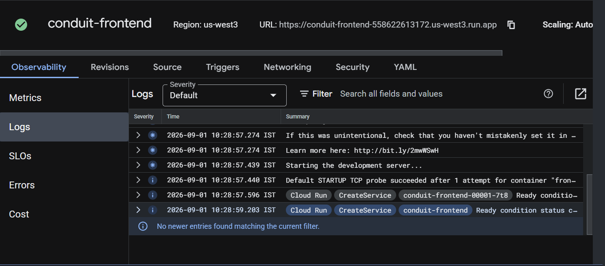

# Conduit Frontend

React and Redux frontend for the Conduit RealWorld blogging application. It supports registration, login, articles, comments, favorites, tags, profiles, and following users.

## Architecture

```text
Browser -> React frontend on Cloud Run -> Express backend on Cloud Run -> Neon PostgreSQL
```

The frontend never connects directly to Neon. It sends requests to the backend using `REACT_APP_API_ROOT`.

## Prerequisites

- Node.js 10 and npm for this older React toolchain
- Git
- Docker for deployment
- A running backend API

## Run locally

```bash
npm install
```

PowerShell:

```powershell
$env:REACT_APP_API_ROOT="http://localhost:3000/api"
npm start
```

Linux or macOS:

```bash
export REACT_APP_API_ROOT=http://localhost:3000/api
npm start
```

The frontend runs on `http://localhost:4100`. The backend must run separately on `http://localhost:3000`.

## Functionality

- User registration, login, and logout
- JWT-based authentication
- Create, read, update, and delete articles
- Add and delete comments
- Favorite and unfavorite articles
- Follow and unfollow users
- Filter articles by author or tag
- Paginated article lists

## Tests

```bash
npm test -- --watchAll=false
```

## Docker

Build the image. Use the deployed backend URL instead of localhost when deploying:

```bash
docker build \
  --build-arg REACT_APP_API_ROOT=http://localhost:3000/api \
  -t conduit-frontend:local .
```

Run it:

```bash
docker run --name conduit-frontend -p 4100:4100 conduit-frontend:local
```

## Cloud Run deployment

The backend URL is included during the Docker build because React embeds environment values into its generated files.

```bash
export PROJECT_ID=$(gcloud config get-value project)
export REGION=us-east4
export BACKEND_URL=https://your-backend-cloud-run-url
export IMAGE=$REGION-docker.pkg.dev/$PROJECT_ID/conduit/frontend:v1.0.0

docker build \
  --build-arg REACT_APP_API_ROOT=$BACKEND_URL/api \
  -t conduit-frontend:local .

docker tag conduit-frontend:local $IMAGE
docker push $IMAGE

gcloud run deploy conduit-frontend \
  --image $IMAGE \
  --region $REGION \
  --port 4100 \
  --no-allow-unauthenticated
```

## CI/CD

The workflow is `.github/workflows/ci-cd.yml`. On every push to `main`, GitHub Actions checks out the code, installs dependencies, runs tests, runs `npm audit`, builds and pushes a Docker image, and deploys it to Cloud Run.

Required GitHub secrets:

```text
GCP_PROJECT_ID
GCP_SA_KEY
BACKEND_URL
```

## Versioning

Images use `v1.0.<GitHub run number>`, for example `frontend:v1.0.12`, so every deployment can be traced to a CI/CD run.

## Security

- The frontend contains no database credentials.
- `.env` files and service-account JSON keys are excluded from Git.
- `npm audit --audit-level=high` checks frontend dependencies during CI/CD.
- A production setup should use Workload Identity Federation instead of long-lived service-account keys.

## Monitoring and observability

Cloud Run automatically captures frontend request and container logs. View them at:

```text
Google Cloud Console -> Cloud Run -> conduit-frontend -> Logs
```

Request count, latency, CPU, memory, instances, and errors are available at:

```text
Google Cloud Console -> Cloud Run -> conduit-frontend -> Metrics
```

## Challenges and solutions

- The frontend originally called an external API, so the API client was changed to use a configurable backend URL.
- The old Create React App toolchain requires Node.js 10 locally.
- The backend URL must be available before building the frontend image.
- Qwiklabs restricted public Cloud Run IAM changes, so the service was deployed privately for testing.

## Deployment and logs

The frontend was deployed successfully to Google Cloud Run. The screenshot below shows the deployed service, its region and URL, and the Cloud Run startup logs.


